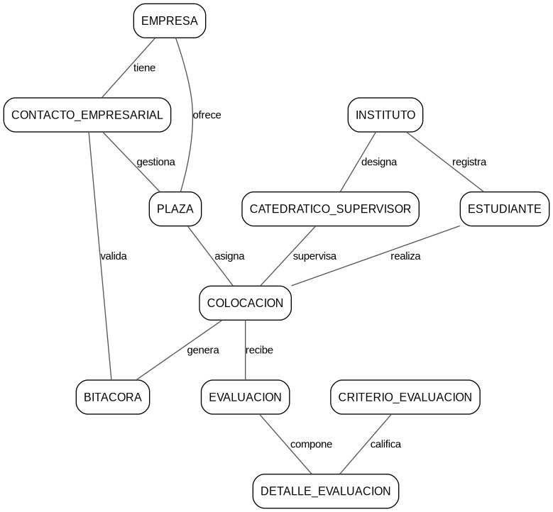

# Práctica 1 — Sistema de Gestión de EPS

## Descripción del proyecto

En esta práctica se diseñó una base de datos relacional para administrar las Prácticas Profesionales Supervisadas (EPS) de estudiantes de institutos técnicos. El modelo representa el proceso completo: registro de instituciones y empresas, publicación de plazas, colocación de estudiantes, control de horas mediante bitácoras y evaluaciones parciales y finales.

La solución se preparó para **Oracle Database 11g** y fue modelada con **Oracle SQL Developer Data Modeler**.

## Cómo se desarrolló

El trabajo se realizó en cuatro etapas:

1. **Análisis del enunciado:** se identificaron visualmente las entidades, sus atributos y las relaciones descritas en el problema.
2. **Modelo conceptual:** se representaron las entidades y cardinalidades principales mediante notación Chen.
3. **Modelos lógico y relacional:** el diseño se trasladó a Oracle SQL Developer Data Modeler, se normalizó hasta Tercera Forma Normal y se definieron claves primarias, foráneas y únicas.
4. **Implementación y documentación:** se generó el script DDL para Oracle y se documentaron los 63 atributos del modelo en el diccionario de datos.

## Decisiones de diseño

- `COLOCACION` conserva el historial de las asignaciones de cada estudiante a una plaza y enlaza al catedrático responsable.
- `BITACORA` registra las horas y actividades de una colocación, además del contacto empresarial que validó cada entrada.
- `EVALUACION` representa los momentos parcial y final de la práctica.
- `DETALLE_EVALUACION` resuelve la relación entre evaluaciones y criterios, permitiendo asignar una puntuación diferente a cada criterio.
- Las empresas, contactos, plazas, institutos y catedráticos se separaron en entidades independientes para evitar duplicidad de información.

## Resultado

El modelo final contiene:

- 11 entidades convertidas en tablas.
- 63 atributos documentados.
- 14 relaciones implementadas mediante claves foráneas.
- Restricciones únicas para carné, identificación del catedrático, código MINEDUC y nombre del criterio.
- Un script DDL compatible con Oracle Database 11g.

## Modelo conceptual

## Archivos entregados

| Archivo | Descripción |
| --- | --- |
| `Diccionario.pdf` | Diccionario de datos con el análisis visual del enunciado. |
| `DiccionarioDatos.csv` | Fuente tabular de los 63 atributos documentados. |
| `ModeloConceptual.png` | Imagen del modelo conceptual. |
| `ModeloConceptual.svg` | Versión vectorial del modelo conceptual. |
| `ModeloConceptual.dot` | Código fuente del diagrama conceptual en Graphviz. |
| `Practica1_EPS.dmd` | Proyecto de Oracle SQL Developer Data Modeler. |
| `Practica1_EPS/` | Archivos internos de los modelos lógico y relacional. |
| `MODELO_RELACIONAL_EPS.ddl` | Script de creación de las 11 tablas y sus relaciones. |
| `Practica1.pdf` | Enunciado original de la práctica. |

## Herramientas utilizadas

- Oracle SQL Developer Data Modeler 24.3.
- Oracle Database 11g.
- Graphviz para el modelo conceptual.
